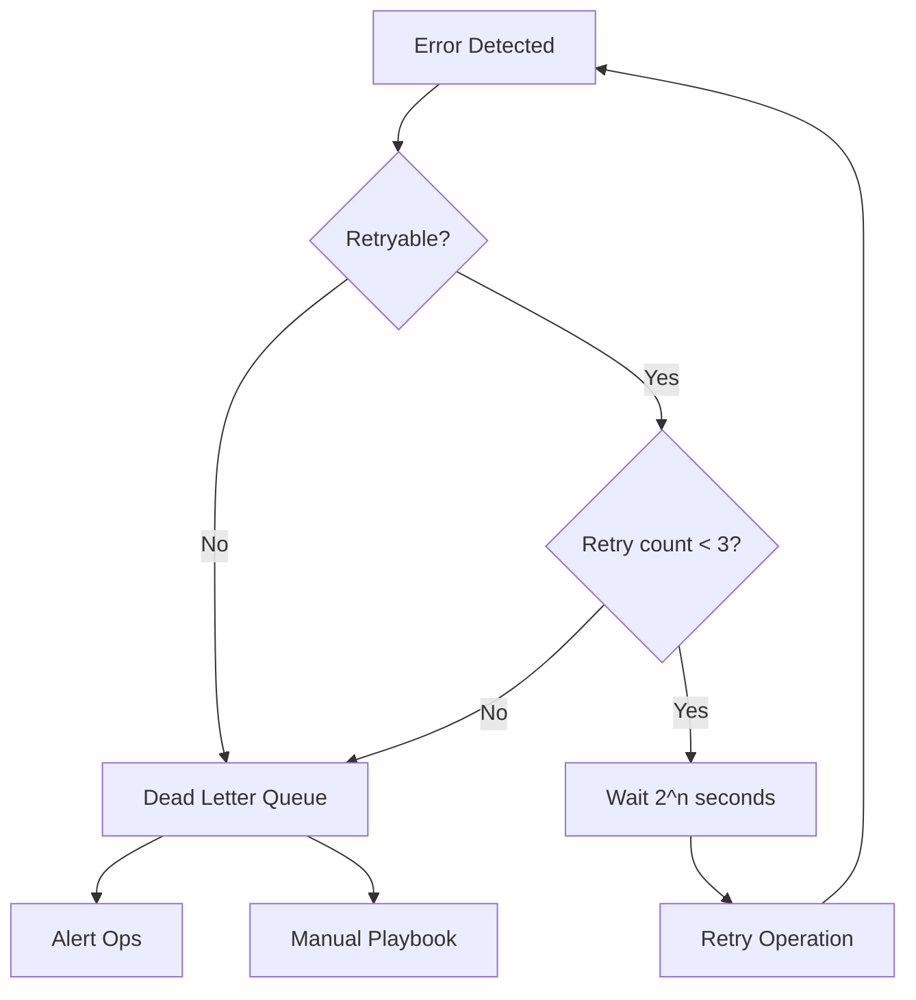

# Incoming Resume Intake — Error Handling

**Workflow ID:** WF-02  
**Version:** 1.0.0  

---

## 1. Error Handling Philosophy

**Detect early, fail visibly, recover safely.** No silent degradation of candidate data. Every error produces a correlation ID, structured reason code, and prescribed recovery path.

---

## 2. Error Catalog

| Error | Detection | User Impact | System Response | Recovery |
|-------|-----------|-------------|-----------------|----------|
| **Invalid PDF** | Magic bytes / parse exception | Upload rejected | Notify submitter with format guide | Re-upload as PDF/A or DOCX |
| **Corrupt document** | CRC / truncated file | Processing halted | Quarantine file | Request new copy |
| **Missing fields** | Schema validator | Partial record | `PARTIAL` status + review | Human completes fields |
| **OCR failure** | Empty text, low char count | Delay | Route to manual transcription | Recruiter data entry UI |
| **AI timeout** | 120s no response | Delay | Retry ×3 exponential backoff | DLQ + on-call if persistent |
| **Invalid JSON** | JSON parse error | Delay | Repair prompt attempt once | Human fix or re-run |
| **Duplicate candidate** | Email/hash match | None if merged | Link to existing `candidate_master_id` | Recruiter confirms merge |
| **Unsupported format** | Extension/MIME check | Upload rejected | List supported formats | Convert and re-upload |
| **Network failure** | HTTP timeout/5xx | Delay | Circuit breaker + retry | Queue for batch retry |
| **Human override** | Review console action | Decision changed | Log override reason + actor | Supersedes AI output |

---

## 3. Retry Strategy



| Error Type | Max Retries | Backoff |
|------------|-------------|---------|
| AI timeout | 3 | 2s, 4s, 8s |
| Network 5xx | 5 | 1s, 2s, 4s, 8s, 16s |
| Rate limit 429 | 3 | Respect Retry-After header |
| Invalid JSON | 1 | Repair prompt |
| OCR failure | 0 | Immediate human route |

---

## 4. Logging Strategy

### Structured Log Fields
```json
{
  "timestamp": "ISO8601",
  "level": "ERROR",
  "workflow_id": "WF-02",
  "workflow_run_id": "uuid",
  "correlation_id": "uuid",
  "error_code": "AI_TIMEOUT",
  "message": "LLM did not respond within 120s",
  "retry_count": 2,
  "candidate_id_hash": "sha256_prefix"
}
```

### Log Destinations
| Destination | Content | Retention |
|-------------|---------|-----------|
| Application logs | All errors | 90 days |
| SIEM | P1/P2 security and compliance | 7 years |
| DLQ metadata | Failed payloads (redacted) | 90 days |
| Review audit | Human overrides | 7 years |

### PII Rules
- Never log full resume text in error logs.
- Log file hash and path only.
- Candidate email masked: `r***@domain.com`

---

## 5. Human Override Protocol

1. Reviewer opens item in Review Console with full context.
2. Selects **Override AI Output** with mandatory reason code.
3. System logs: original AI output, override fields, reviewer ID, timestamp.
4. Override outputs marked `source: HUMAN_OVERRIDE` in artifact metadata.
5. Monthly QA sample of overrides per `AI Quality Review SOP`.

---

## 6. Escalation Matrix

| Severity | Condition | Response Time | Escalate To |
|----------|-----------|---------------|-------------|
| P1 | DLQ flood, PII leak suspect | 15 min | AI Ops on-call + CISO |
| P2 | Workflow down > 1 hour | 30 min | TA Technology Lead |
| P3 | Single item stuck | 4 hours | TA Specialist |
| P4 | Format rejection | Next business day | Recruiter |

---

*End of Error Handling — WF-02*
