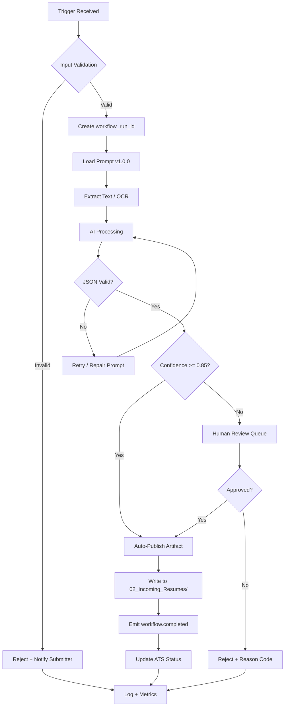
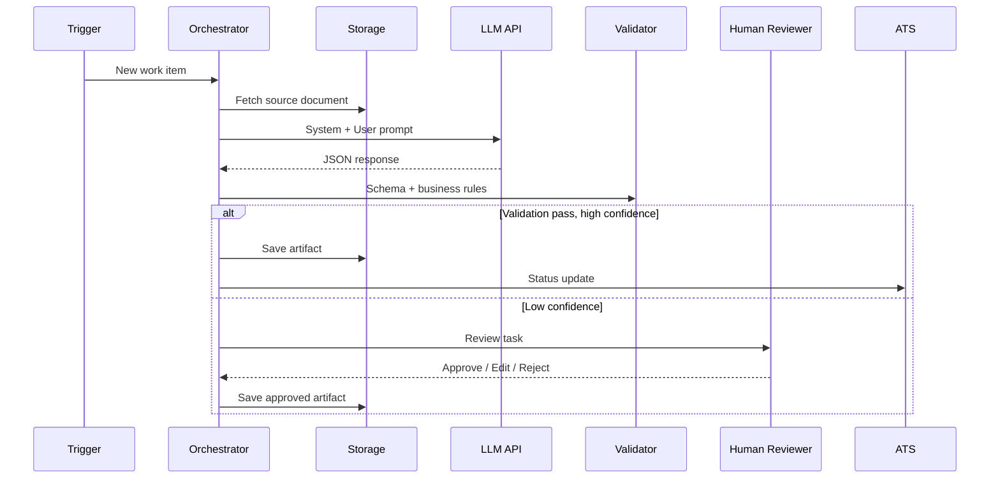
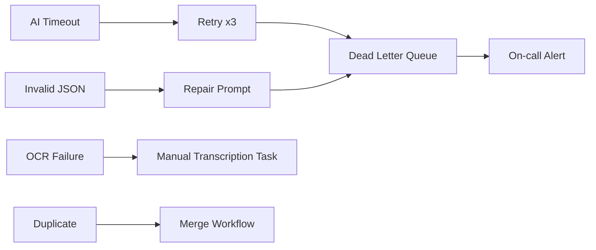

# Incoming Resume Intake — Execution Flow

**Workflow ID:** WF-02  
**Version:** 1.0.0  

---

## 1. Overview

This document describes the runtime execution path for **Incoming Resume Intake**, including automation entry points, AI invocation boundaries, human review gates, storage locations, and failure handling.

---

## 2. Trigger Sources

| Source | Mechanism | Priority |
|--------|-----------|----------|
| ATS webhook | REST POST `/hooks/02_Incoming_Resumes` | Standard |
| Email intake | Parser → object storage | Standard |
| Manual upload | SharePoint drop folder | High |
| Upstream workflow | Event bus `workflow.completed` | Standard |
| Scheduled retry | Cron every 15 min (DLQ) | Low |

---

## 3. Primary Execution Flow

---

## 4. Sequence Diagram — AI Invocation

---

## 5. Storage Map

| Stage | Location | Retention |
|-------|----------|-----------|
| Raw intake | `02_Incoming_Resumes/` (if applicable) | 7 years |
| Processed output | `02_Incoming_Resumes/` | 7 years |
| Failed items | `DLQ/02_Incoming_Resumes/` | 90 days |
| Audit logs | SIEM / Log Analytics | 7 years |
| Review decisions | Review Console DB | 7 years |

---

## 6. Failure Paths

---

## 7. Latency Budget

| Step | Target P50 | Target P95 |
|------|------------|------------|
| Validation | 2s | 5s |
| Text extraction | 5s | 30s |
| AI call | 15s | 90s |
| Schema validation | 1s | 3s |
| Human review | 4h SLA | 24h SLA |
| **Total automated path** | **< 2 min** | **< 5 min** |

---

## 8. Idempotency

- All runs keyed by `workflow_run_id` + `content_hash`.
- Re-trigger with same hash returns existing artifact unless `force=true`.
- Prevents duplicate ATS updates and double-charging API usage.

---

*End of Execution Flow — WF-02*
