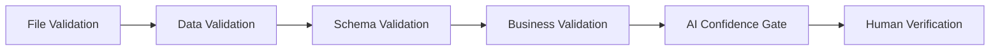

# Resume Data Extraction — Validation Framework

**Workflow ID:** WF-03  
**Version:** 1.0.0  

---

## 1. Validation Layers

Validation is applied in **four layers** before any artifact is published or synced to the ATS.



---

## 2. File Validation

| Check | Rule | Fail Action |
|-------|------|-------------|
| Extension | `.pdf`, `.docx`, `.doc`, `.txt` | Reject |
| MIME type | Matches extension magic bytes | Reject |
| Size | ≤ 10 MB | Reject |
| Virus scan | Clean per Defender/API | Quarantine |
| Encryption | Not password-protected | Reject with instructions |
| Readability | ≥ 100 chars extractable OR OCR path | OCR fallback |

---

## 3. Data Validation

| Field | Rule |
|-------|------|
| Email | RFC 5322 format |
| Phone | E.164 or regional format with country |
| Dates | ISO 8601, start ≤ end |
| URLs | HTTPS preferred, malware scan |
| Skills | Normalized against ontology |
| Names | Non-empty, no placeholder values ("Test", "N/A") |

---

## 4. Schema Validation

- Engine: `jsonschema` draft 2020-12
- Schemas loaded from `schemas/` at runtime
- Schema version pinned in workflow config
- Breaking schema changes require migration script

```python
from jsonschema import validate, ValidationError
validate(instance=output, schema=load_schema("WF-03_output"))
```

---

## 5. Business Validation

| Rule | Description |
|------|-------------|
| BV-01 | Requisition must be `OPEN` status |
| BV-02 | Candidate consent flag true for EU/UK |
| BV-03 | No duplicate active application same req |
| BV-04 | Match score components sum to weight 1.0 |
| BV-05 | Interview questions exclude protected-class probes |
| BV-06 | Offer compensation within approved band |

---

## 6. AI Confidence Score

| Aggregate Score | Action |
|-----------------|--------|
| ≥ 0.85 | Auto-publish eligible |
| 0.70 – 0.84 | Mandatory TA review |
| 0.50 – 0.69 | Mandatory TA + spot check |
| < 0.50 | Reject automation; manual processing |

Field-level scores below 0.60 highlighted in review UI.

---

## 7. Human Verification

**Always required for:**
- Final hire/reject decisions
- Compensation outside band
- Any compliance flag
- First 50 runs after prompt version change (per Prompt Testing SOP)

**Spot check sampling:** 10% of auto-published items weekly per AI Quality Review SOP.

---

*End of Validation Framework — WF-03*
