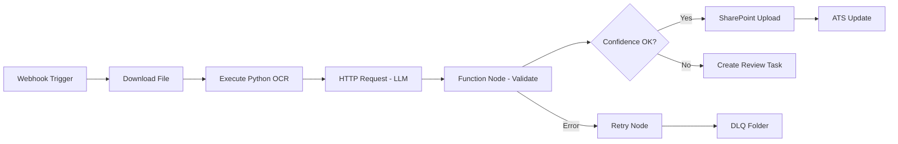

# JD-Candidate Matching — Automation Implementation Guide

**Workflow ID:** WF-04  
**Version:** 1.0.0  

---

## 1. Automation Strategy

This workflow is designed for **composable automation**: each platform handles what it does best. Cursor accelerates prompt iteration; Python handles validation and ATS integration; n8n orchestrates visual workflows; Zapier/Make connect SaaS edges; REST/webhooks tie the ATS and storage layers together.

---

## 2. Component Responsibility Matrix

| Component | Responsibility in Matcher |
|-----------|--------------------------------|
| **Cursor** | Prompt development, eval script authoring, documentation maintenance |
| **Python** | OCR pipeline, JSON validation, ATS SDK, batch reprocessing, metrics |
| **n8n** | Primary orchestrator: triggers, branching, retries, human task creation |
| **Zapier** | Lightweight connectors for teams without n8n (email → Drive) |
| **Make.com** | Complex multi-app scenarios (SharePoint + OpenAI + Slack) |
| **REST APIs** | LLM gateway, ATS, schema registry, review console |
| **Webhooks** | ATS application events, upstream workflow completion |
| **Google Drive** | Alternative intake folder for regional teams |
| **SharePoint** | Primary document library for `04_Match_Results/` |
| **Email** | Application alias parsing, failure notifications |
| **ATS** | System of record for requisition and candidate status |

---

## 3. Cursor Implementation

**Use case:** Prompt engineering and regression testing.

```
1. Open 09_Prompt_Library/ and 04_Match_Results/Prompt.md in Cursor.
2. Use Agent to run eval against samples/Rahul_Sharma.json.
3. Commit prompt version bump with eval results in docs/.
```

**Responsibility:** Developer productivity, not production runtime.

---

## 4. Python Implementation

```python
# Pseudocode — production worker for WF-04
def process_item(workflow_run_id, payload):
    doc = fetch_from_sharepoint(payload["path"])
    text = extract_text(doc) or ocr_fallback(doc)
    result = llm_client.complete(system=prompt_system, user=build_user(text, payload))
    validated = validate_schema(result, schema="WF-04_output")
    if validated.confidence < 0.85:
        create_review_task(workflow_run_id, validated)
    else:
        save_artifact(f"04_Match_Results/", validated)
        emit_event("workflow.completed", workflow_run_id)
```

**Libraries:** `pypdf`, `python-docx`, `jsonschema`, `httpx`, `azure-identity`  
**Responsibility:** Heavy logic, idempotency, secure credential handling.

---

## 5. n8n Workflow



**Responsibility:** Visual orchestration, retry policies, non-developer maintainability.

---

## 6. Zapier / Make.com

| Platform | Pattern | When to Use |
|----------|---------|-------------|
| Zapier | Gmail attachment → Google Drive → Webhook to n8n | Small teams, quick MVP |
| Make.com | SharePoint watch → OpenAI → Teams notification | Microsoft-centric orgs |

**Responsibility:** Edge integration only — not core validation logic.

---

## 7. REST API Contracts

### Inbound Webhook
```
POST /api/v1/workflows/04_Match_Results/run
Authorization: Bearer {service_token}
Content-Type: application/json

{
  "requisition_id": "REQ-2026-0142",
  "candidate_id": "CAN-88421",
  "source_path": "sharepoint://...",
  "priority": "standard"
}
```

### Outbound Event
```
POST {subscriber_url}
{
  "event": "workflow.completed",
  "workflow_id": "WF-04",
  "workflow_run_id": "RUN-uuid",
  "artifact_path": "04_Match_Results/REQ-2026-0142_CAN-88421_output.json"
}
```

---

## 8. SharePoint Integration

- **Library:** `RecruitmentOps/04_Match_Results/`
- **Metadata columns:** RequisitionID, CandidateID, ConfidenceScore, PromptVersion
- **Flow:** n8n uploads approved JSON + links source PDF
- **Permissions:** HR-TA-Contributors write; HM read on assigned reqs only

---

## 9. Email Automation

| Event | Template | Recipient |
|-------|----------|-----------|
| Intake rejected | `INTAKE_REJECT` | Candidate / Recruiter |
| Review needed | `REVIEW_REQUIRED` | TA Specialist |
| Stage complete | `STAGE_COMPLETE` | Hiring Manager |

Parse inbound applications via dedicated alias `careers+04_Match_Results@{{org.email_domain}}`.

---

## 10. ATS Integration

| Action | ATS Endpoint | Timing |
|--------|--------------|--------|
| Update stage | PATCH /candidates/{id}/stage | After publish |
| Attach artifact | POST /candidates/{id}/attachments | After publish |
| Log note | POST /candidates/{id}/notes | On human review |

Fallback: create recruiter task if API unavailable > 15 min.

---

## 11. Monitoring & Alerting

- n8n execution failures → PagerDuty (P1 if DLQ > 50/hour)
- Python worker health → Kubernetes liveness probe
- LLM latency → Datadog dashboard, alert P95 > 120s

---

*End of Automation Guide — WF-04*
