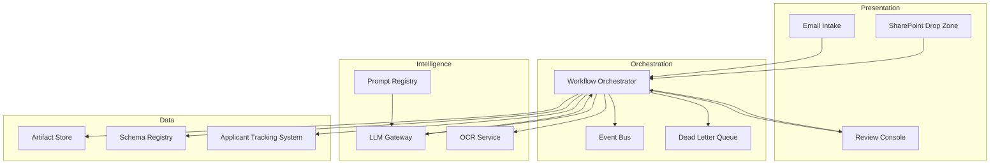

# Final Hiring Decision — Architecture

**Workflow ID:** WF-08  
**Version:** 1.0.0  

---

## 1. Architectural Context

This workflow operates as a **stage** within the modular recruitment pipeline. It adheres to event-driven, schema-first design with clear separation between ingestion, intelligence, validation, and human approval layers.

---

## 2. Component Diagram



---

## 3. Layer Responsibilities

| Layer | Components | Responsibility |
|-------|------------|----------------|
| Presentation | SharePoint, Email, Review UI | Human and system entry points |
| Orchestration | n8n / Python / Azure Functions | State machine, retries, routing |
| Intelligence | LLM, OCR, Prompt Registry | Unstructured → structured transformation |
| Data | S3/SharePoint, PostgreSQL, ATS | Persistence, canonical records |
| Governance | Schema Registry, Audit Log | Compliance, traceability |

---

## 4. Technology Choices

| Decision | Choice | Rationale |
|----------|--------|-----------|
| LLM access | Azure OpenAI private endpoint | Enterprise data residency, SLA |
| Orchestration | n8n self-hosted + Python workers | Visual ops + complex logic |
| Storage | SharePoint + blob archive | HR familiarity + immutability |
| Validation | JSON Schema + custom rules engine | Fail fast before ATS write |
| Identity | Azure AD SSO | RBAC aligned to HR org |

---

## 5. Security Architecture

- **Encryption at rest:** AES-256 for all artifact stores.
- **Encryption in transit:** TLS 1.2+ for all API calls.
- **RBAC:** TA Specialist, HM, HRBP, Admin roles with least privilege.
- **PII handling:** Tokenization in logs; full PII only in secured artifact paths.
- **Network:** LLM calls via private endpoint; no public internet for candidate data.

---

## 6. Scalability

- Horizontal scale of stateless Python workers behind queue.
- LLM rate limiting with token bucket per workflow priority.
- Batch mode for nightly reprocessing of DLQ items.

---

## 7. Integration Points

| System | Direction | Protocol |
|--------|-----------|----------|
| Workday/Greenhouse ATS | Bi-directional | REST API |
| SharePoint | Inbound files | Graph API |
| Email (O365) | Inbound | Graph webhook |
| SIEM | Outbound logs | Syslog / HTTP |
| Power BI | Outbound metrics | SQL / API |

---

## 8. Deployment Model

```
Dev → Test (synthetic data only) → Staging (masked prod) → Production
```

Prompt and schema changes require promotion through all environments with eval gates.

---

*End of Architecture — WF-08*
