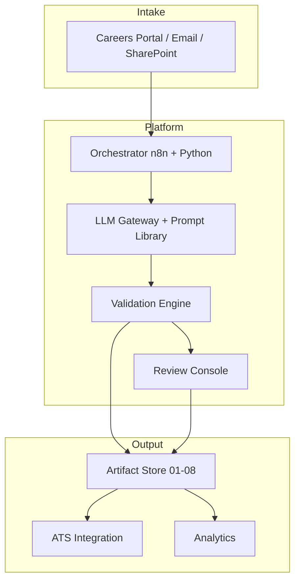

# AI Recruitment Operations Platform

**Version:** 1.0.0  
**Last Updated:** 2026-08-03  
**Maintained By:** AI Operations — Talent Technology  
**Classification:** Internal — Enterprise Documentation  

---

## Project Overview

The **AI Recruitment Operations Platform** is a comprehensive documentation and automation blueprint for enterprise talent acquisition. It defines how an AI Operations Specialist designs, documents, and automates the end-to-end hiring workflow—from job description parsing through final hiring decisions.

This repository is **documentation-first**: it does not ship application code, but provides production-quality specifications sufficient for an engineering team to build, deploy, and operate the system.

### Business Value

| Capability | Impact |
|------------|--------|
| Standardized JD parsing | Consistent job postings, better applicant fit |
| Automated resume extraction | 60%+ reduction in manual ATS data entry |
| AI-powered matching | Faster shortlisting with explainable scores |
| Interview question generation | Calibrated, compliant interview guides |
| Feedback synthesis | Reduced decision latency post-interview |
| Governed prompts & SOPs | Audit-ready, compliant AI operations |

---

## Architecture

The platform follows an **event-driven, schema-first, human-in-the-loop** architecture.



See `diagrams/01_overall_architecture.mmd` for the complete diagram.

---

## Folder Structure

```
AI-Recruitment-System/
├── 01_Job_Descriptions/     # WF-01: JD parsing and management
├── 02_Incoming_Resumes/     # WF-02: Resume intake and routing
├── 03_Extracted_Data/       # WF-03: Resume data extraction
├── 04_Match_Results/        # WF-04: JD-candidate matching
├── 05_Shortlisted/          # WF-05: Shortlist approval
├── 06_Interview_Questions/  # WF-06: Interview guide generation
├── 07_Interview_Feedback/   # WF-07: Feedback processing
├── 08_Final_Decision/       # WF-08: Hire/reject decision pack
├── 09_Prompt_Library/       # Reusable governed prompts
├── 10_SOPs/                 # Standard operating procedures
├── docs/                    # Governance and reference docs
├── diagrams/                # Mermaid architecture diagrams
├── schemas/                 # JSON Schema definitions
├── samples/                 # Realistic example artifacts
└── README.md
```

Each workflow folder (01–08) contains **11 documents**:
`Workflow_Spec.md`, `Prompt.md`, `Execution_Flow.md`, `Architecture.md`, `Automation.md`, `Error_Handling.md`, `Validation.md`, `Metrics.md`, `Example_Input.md`, `Example_Output.md`, `Human_Review.md`.

---

## Workflow Summary

| # | Workflow | Trigger | Primary Output | Human Gate |
|---|----------|---------|----------------|------------|
| 01 | Job Description Parsing | HM submits JD | Structured JD JSON | TA review |
| 02 | Resume Intake | Candidate applies | Intake receipt + routing | Exception only |
| 03 | Data Extraction | Resume queued | Candidate profile JSON | Low confidence |
| 04 | JD Matching | Profile + JD ready | Match score report | Optional |
| 05 | Shortlisting | Match published | Approved shortlist | **HM approval** |
| 06 | Interview Questions | Interview scheduled | Question guide | **HM approval** |
| 07 | Feedback Processing | Interviewer submits | Feedback synthesis | Conflict escalation |
| 08 | Final Decision | All stages complete | Offer/reject package | **HM + HRBP** |

---

## Technology Stack

| Layer | Technology |
|-------|------------|
| LLM | Azure OpenAI (GPT-4o), Claude 3.5 (eval) |
| Orchestration | n8n (self-hosted), Python 3.11+ workers |
| Validation | JSON Schema, custom business rules |
| Storage | SharePoint Online, Azure Blob (archive) |
| ATS | Workday Recruiting / Greenhouse (API) |
| Identity | Azure AD SSO |
| Monitoring | Datadog, Power BI, SIEM |
| OCR | Azure Document Intelligence |

---

## Automation Stack

| Tool | Role |
|------|------|
| **Cursor** | Prompt development, eval scripts, documentation |
| **Python** | OCR, validation, ATS SDK, batch processing |
| **n8n** | Primary workflow orchestration, retries, webhooks |
| **Zapier** | Lightweight email → storage connectors |
| **Make.com** | Microsoft 365 + OpenAI integration scenarios |
| **REST APIs** | LLM gateway, ATS, schema registry |
| **Webhooks** | ATS events, upstream workflow handoffs |
| **Google Drive** | Regional team intake (optional) |
| **SharePoint** | Primary document library for artifacts |
| **Email** | Application parsing, notifications |

---

## Prompt Library

Located in `09_Prompt_Library/`:

1. Resume Parser
2. JD Parser
3. JD Matcher
4. Candidate Summary
5. Interview Generator
6. Interview Evaluation
7. Offer Letter Generator
8. Email Generator
9. Candidate Rejection
10. Knowledge Base Search

All prompts are versioned, owned, and governed per `10_SOPs/Prompt_Governance_SOP.md`.

---

## Documentation Index

| Category | Location | Count |
|----------|----------|-------|
| Workflow specs | `01_` – `08_` | 88 files |
| Prompt library | `09_Prompt_Library/` | 10 files |
| SOPs | `10_SOPs/` | 10 files |
| JSON schemas | `schemas/` | 6 files |
| Diagrams | `diagrams/` | 7 files |
| Sample artifacts | `samples/` | 9 files |
| Governance docs | `docs/` | 3 files |

---

## Future Roadmap

### Q3 2026
- [ ] Workday Recruiting bi-directional API integration spec
- [ ] Multimodal portfolio/GitHub enrichment with consent flow
- [ ] Hindi and Spanish resume parsing locale packs

### Q4 2026
- [ ] Active learning pipeline from reviewer corrections
- [ ] Predictive time-to-fill analytics model
- [ ] Candidate self-scheduling integration

### 2027
- [ ] Internal mobility workflow extension
- [ ] DEI adverse impact monitoring dashboard
- [ ] Full SOC 2 Type II audit package for AI hiring ops

---

## Getting Started

1. Read this README and `docs/governance_framework.md`.
2. Review workflow `01_Job_Descriptions/Workflow_Spec.md` as the entry point.
3. Examine `samples/` for realistic input/output artifacts.
4. Follow `10_SOPs/` for operational procedures.
5. Use `diagrams/` and `schemas/` for implementation planning.

---

## Contact

**{{contact.ai_ops_role}}:** {{contact.ai_ops}}  
**{{contact.ta_ops_role}}:** {{contact.ta_ops}}  
**{{contact.hr_compliance_role}}:** {{contact.hr_compliance}}  

---

*{{org.copyright}}*
