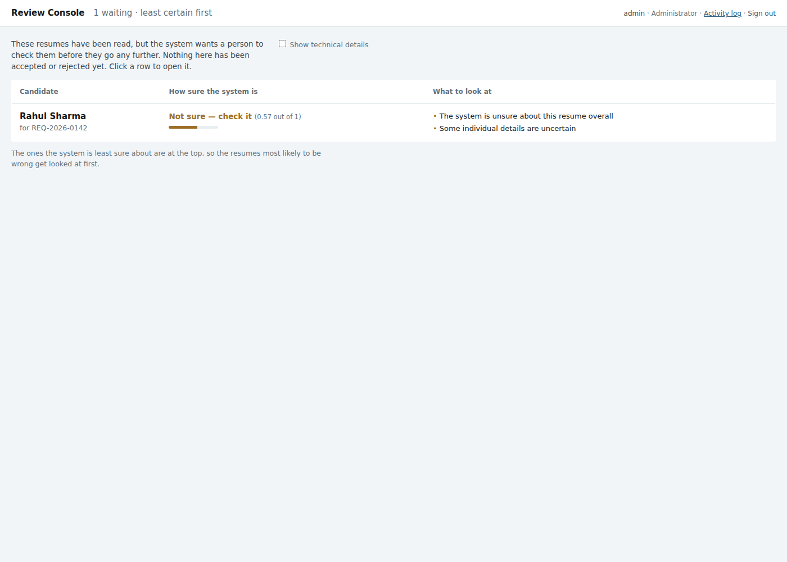
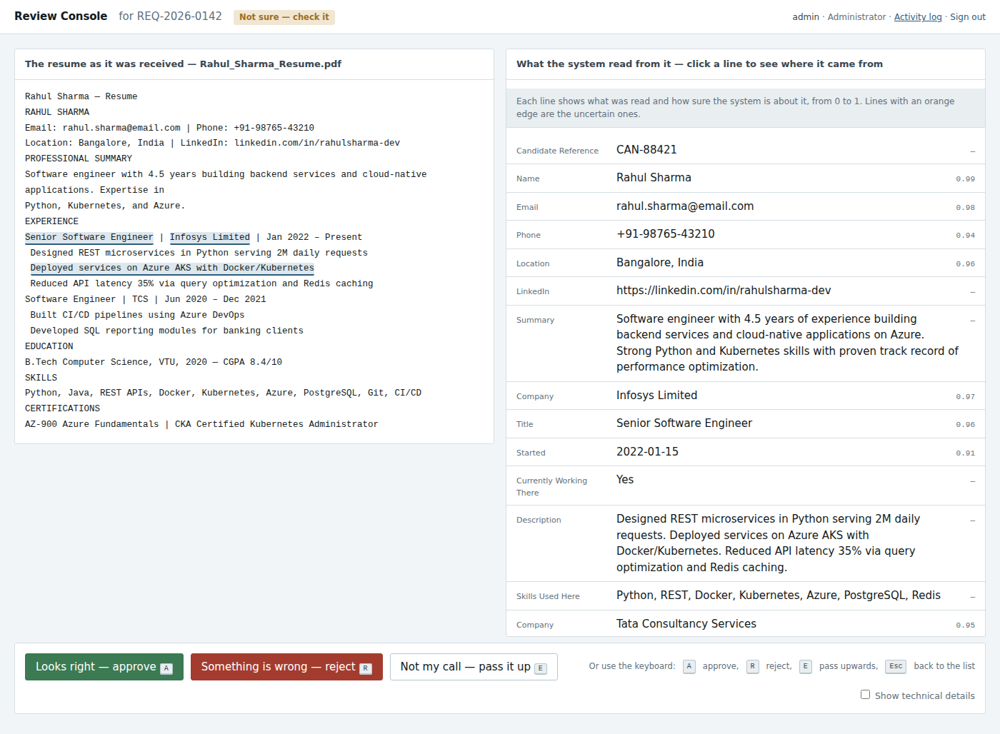
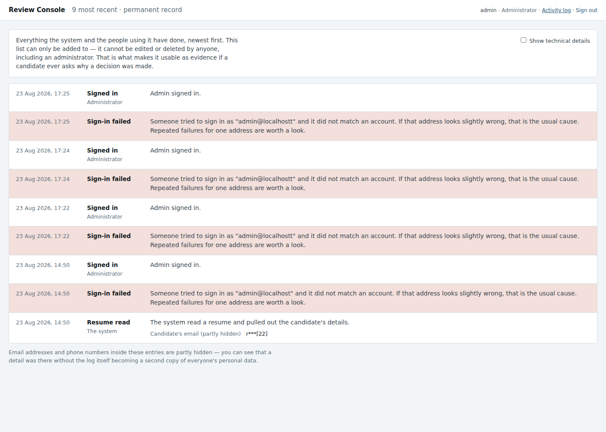

# AI Recruitment System

Read a resume, pull out the facts, score it against a job's requirements, and put
the result in front of a human — with a quote from the document behind every
claim, and a record of who decided what.

It is a screening assistant. **It does not decide anything.** Every candidate-
affecting outcome is approved, rejected, or escalated by a named person, and the
record of that is append-only.



*Resumes the system wants a person to look at. It says how sure it is in words
as well as numbers, and what specifically to check — the reviewers are
recruiters and hiring managers, not engineers.*



*The resume on the left, what was read from it on the right. Click any line and
the exact span it came from lights up in the source — evidence, not assertion.*



*Every action, in plain English, in a log that cannot be edited or deleted by
anyone — including an administrator. The identifiers an auditor needs are one
checkbox away, not thrown out.*

---

## What this took

It started as 136 files of documentation with zero runnable code — a
specification for a system nobody had built. It is now a working product with
**216 passing tests**, and the parts that were genuinely hard:

- **A model that cannot return a fit score.** Not "is instructed not to" — the
  score fields are stripped from the tool schema before the call, so returning
  one is structurally impossible and a future prompt edit cannot reintroduce it.
  Components are judged separately, with evidence, and combined arithmetically in
  application code from config weights. That is what makes a rejection
  defensible if a candidate challenges it.
- **A hallucination defence with numbers behind it.** Every quoted detail is
  fuzzy-matched back against the source document. It caught an invented
  "Principal Engineer at Google DeepMind" at 0.46 and a plausible-but-absent AWS
  certification at 0.52 — while a genuine quote mangled by PDF line breaks still
  scored 1.00, because the normalisation step exists so line-break noise never
  produces a false accusation of fabrication.
- **An audit log that is append-only in two layers**, verified against a real
  Postgres 16 cluster: both `UPDATE` and `DELETE` rejected at the database. The
  application layer alone falls to anyone with a database prompt; the database
  layer alone vanishes if a migration is skipped.
- **A bias harness that is itself under test.** A fake model with a known
  injected penalty *must* be caught, or the suite fails — because a harness that
  has never detected bias cannot support a claim of finding none. Findings are
  attributed per component, so it reports "the domain-match score leaks the
  university name", which is fixable, rather than "the total moved", which is not.
- **Evidence you can click.** Selecting an extracted field highlights the exact
  span of the source document it came from, by stored character offsets — not by
  searching for the text in the browser, which highlights the wrong occurrence
  whenever a phrase repeats. There is a test for exactly that.
- **Content hashing over source bytes, not extracted text**, so a `pypdf`
  upgrade cannot silently break idempotency and re-bill for every resume.
- **Authorisation at the route, never in the template.** A test renders the
  Approve button for a recruiter and then asserts that POSTing to the URL still
  returns 403.
- **A test that walks every import in `src/` and fails if it is undeclared.** It
  found two real dependencies that were working only by accident.

---

## Two honest notes before you read further

**Built with AI as a pair programmer, deliberately and in the open.** That is how
I work and how I intend to keep working; the interesting question is not whether
a tool was used but what judgement went in around it. Here, that meant cutting
six of the eight specified workflows to protect a shippable core, refusing an
architecture that would have produced an indefensible single fit score, insisting
that nothing counted as finished until it had been run on a machine without the
dependencies already installed — a rule that caught two real packaging defects —
and pushing back when the first answer was wrong. `CLAUDE.md` records all of it,
dated, including the decisions that had to be reversed. It is the most useful
file in the repository.

**Nothing here has been independently verified.** No accuracy figure has been
measured, no DPIA has been performed, and the bias harness is one you run on
yourself rather than an audit. The section below on using it with real
candidates says exactly what is missing. Please do not put this in front of real
applicants without reading it.

---

## Try it in ten minutes

You need [Docker Desktop](https://www.docker.com/products/docker-desktop/). You
do **not** need an API key, a database, or Python.

```bash
git clone <your-copy-of-this-repo> AI-Recruitment-System
cd AI-Recruitment-System
docker compose up
```

First run takes a few minutes to build. Then open **http://localhost:8000**.

You will see a review queue with one candidate in it, produced by running the
real pipeline over the sample resume with a **fake model** — no key, no cost, no
network call. Click the candidate. Every extracted field is clickable, and
clicking one highlights the exact span of the resume it came from. Approve it,
reject it, or escalate it, then open **/audit** and watch what you just did
appear in a log that cannot be edited or deleted.

That is the whole product in three minutes. The remaining seven are below.

**Watch the terminal on first start.** If the config asks for real accounts, an
administrator is created and its password is printed **once**:

```
  ================================================================
   FIRST-RUN PASSWORD — shown once, never stored in readable form

     email     admin@localhost
     password  HRkcijWsfJZkK-7b
  ================================================================
```

Stop it with `Ctrl+C`, then `docker compose down`. Add `-v` to erase the
database too.

### Without Docker

Python 3.11 or newer. This path uses SQLite, so there is no server to install
and no database driver to compile.

```bash
pip install -e ".[web]"
cp config/organization.example.yaml config/organization.yaml
python -m recruit.bootstrap --email you@example.com
python -m recruit.seed
python -m recruit.web
```

Same console, at http://localhost:8000.

---

## What it does, and what it does not

| It does | It does not |
|---------|-------------|
| Read PDF, DOCX and TXT resumes, including scanned ones (OCR) | Decide who to hire, or reject anyone by itself |
| Extract structured facts with a quote backing each one | Produce a single "fit score" — see below |
| Check every quote actually appears in the document | Source, contact, or schedule candidates |
| Score against a job's requirements, component by component | Replace your ATS |
| Route everything to a human, with keyboard-fast review | Give legal advice, or certify your compliance |
| Keep an append-only audit trail of every decision | Guarantee an accuracy number — none has been measured |

Three of those deserve the detail.

**No single fit score.** A number like "78% match" cannot be defended when a
candidate asks why they were rejected. Instead the model judges three things
separately — must-have coverage, experience band, domain match — each with its
own evidence, and *your code* combines them using weights from your config. The
model is not even shown the fields where a total would go; it is structurally
incapable of returning one.

**Every quote is checked.** The model's own confidence is not evidence. Each
snippet it cites is fuzzy-matched back against the source text, and anything
scoring below 0.8 blocks the run as a possible fabrication. In testing this
caught an invented "Principal Engineer at Google DeepMind" (0.46) and a
plausible-but-absent AWS certification (0.52), while a real quote mangled by PDF
line breaks still scored 1.00.

**The audit log cannot be rewritten.** Not by convention — the repository class
exposes no method that mutates it, *and* a database trigger rejects `UPDATE` and
`DELETE`. Either layer alone is theatre: application rules fall to anyone with a
database prompt, database rules vanish if a migration is skipped.

---

## Using it on your own resumes

### 1. Add your API key

The demo queue is fake. Real extraction needs a model.

```bash
cp .env.example .env          # copy .env.example .env   on Windows
```

Put your key in `ANTHROPIC_API_KEY=`. Nothing else in that file is required.

### 2. Point it at your organization

`config/organization.yaml` holds every value specific to you: legal name,
contacts, retention periods per jurisdiction, confidence thresholds, and the
scoring weights. Nothing organization-specific is hardcoded anywhere else, and
`python tools/check_branding.py` fails the build if that ever stops being true.

The one you will change first:

```yaml
matching:
  default_scheme: "default"
  schemes:
    default:
      weights:
        must_have_coverage: 0.5
        experience_band: 0.3
        domain_match: 0.2
```

Weights must sum to 1.0 — the config refuses to load otherwise, because weights
that sum to 0.9 silently deflate everyone's score.

### 3. Run a resume through

```bash
python -m recruit.extract path/to/resume.pdf
python -m recruit.match --candidate <id> --requisition <id>
```

Or drop files into the queue for review:

```bash
python -m recruit.seed path/to/resume.pdf another.docx
```

### 4. Give people accounts

The example config ships with `adapters.auth.provider: single_user`, which means
**the console has no login at all** — fine on your laptop, wrong the moment
anyone else can reach it. For real accounts:

```yaml
adapters:
  auth:
    provider: "local"
```

Then:

```bash
python -m recruit.users add someone@example.com --role recruiter
python -m recruit.users list
python -m recruit.users set-password someone@example.com
```

Four roles, taken from the responsibility tables in the SOPs:

| Role | Can |
|------|-----|
| `admin` | everything, including the audit trail and user management |
| `hiring_manager` | review, **approve**, reject, escalate |
| `recruiter` | review, reject, escalate — **not** approve |
| `auditor` | read the audit trail; change nothing |

A recruiter who cannot approve is not a UI decision. The Approve button is
hidden *and* the route returns 403, and there is a test that renders the button
for a recruiter and then asserts the POST still fails.

---

## Before you use this on real candidates

This is screening software for employment decisions, which is regulated in more
places every year. `docs/compliance/` contains a DPIA template, a candidate
disclosure template, and an appeal process template. **They are templates.**
Every one carries `[ORGANIZATION TO COMPLETE]` blanks, because shipping
finished-looking legal text is worse than shipping none — someone relies on it.

Three specific things are yours, not ours:

- **NYC Local Law 144** requires an *independent* annual bias audit before an
  automated employment decision tool is used on New York candidates. This
  project includes a bias-testing harness (`python -m recruit.bias_audit`) that
  perturbs names, gender signals, university prestige, location and graduation
  year and reports per-component drift. It is a smoke test you run yourself. **It
  is not an independent audit and cannot satisfy LL144.**
- **GDPR Article 35** requires a DPIA to be *performed*, not templated.
- **GDPR Article 22** gives candidates a right to human review. The process is
  documented; the candidate-facing side of it is manual, because there is no
  candidate portal.

And one measurement that does not exist yet: **no accuracy figure has been
established.** The confidence thresholds in the config are round numbers, not
calibrated ones — `confidence.calibrated: false` says so in the file. That needs
a golden set of human-labelled resumes, which is a deliberate, tracked gap (see
`CLAUDE.md`). Until it exists, treat every number the system reports as a
prompt for a human to look, not a measurement to act on.

---

## Commands

| Command | What it does |
|---------|--------------|
| `python -m recruit.bootstrap` | Create the schema and the first administrator. Safe to re-run. |
| `python -m recruit.seed` | Fill the queue from `samples/`, using the fake model. `--force` replays it. |
| `python -m recruit.web` | Start the review console. |
| `python -m recruit.extract <file>` | Extract one document. Real model. |
| `python -m recruit.match` | Score a candidate against a requisition. |
| `python -m recruit.users` | Add, list, deactivate people; set passwords and roles. |
| `python -m recruit.bias_audit` | Run the bias harness. `--self-test` proves it can still detect bias. |
| `python -m recruit.db_init` | Schema only. `--drop` destroys everything. |
| `python tools/check_branding.py` | Fail if any organization value is hardcoded outside `config/`. |
| `python tools/validate_output.py <f>` | Validate a result against its JSON Schema. |

Each is also installed as a console script: `recruit-web`, `recruit-seed`,
`recruit-users`, and so on.

---

## How it fits together

```
resume file
   │
   ├─ ingest     magic-byte check, text extraction, OCR fallback,
   │             content hash over the SOURCE BYTES (so a pypdf upgrade
   │             cannot silently break idempotency)
   │
   ├─ extract    Anthropic tool use with a forced tool choice — the model
   │             cannot answer in prose, so there is no JSON to repair
   │
   ├─ validate   schema, business rules, evidence grounding (VR-03),
   │             cross-field consistency. Returns findings, never a bool
   │
   ├─ persist    Postgres or SQLite. Append-only audit log, PII masked
   │
   ├─ review     the console. Human approves, rejects, or escalates
   │
   └─ match      components scored by the model, combined in our code
```

Configuration, storage, LLM, ATS and auth are all behind adapters. Unimplemented
providers raise a clear `NotImplementedError` rather than silently falling back —
an organization that configures single sign-on and quietly gets password auth has
an incident, not a warning.

---

## Development

```bash
pip install -e ".[all]"
python -m pytest -q
ruff check .
```

CI runs the suite on Python 3.11 and 3.12, the branding check, schema validation
of the sample outputs, the bias harness self-test, and a full Docker build that
asserts the OCR binaries are really in the image.

`CLAUDE.md` is the project's memory: scope decisions, the hard rules, a register
of work that was deferred and why, and a dated decision log. Read it before
changing anything — several of its rules exist because the alternative was tried
and broke something.

### If you are reading this to judge the engineering

The parts worth your time, roughly in order:

| Where | Why it is interesting |
|-------|----------------------|
| `CLAUDE.md` decision log | Every non-obvious decision, with the reasoning and the defects that forced it. Including the ones that were wrong first. |
| `src/recruit/validate.py` | VR-03 — every quoted detail is fuzzy-matched back against the source document. The primary defence against a model inventing an employer. |
| `src/recruit/match.py` | `model_facing_schema()` strips the score fields before the call, so the model is *structurally incapable* of returning an overall fit score. A future prompt edit cannot reintroduce one. |
| `src/recruit/db/migrations.py` | The audit log is append-only in two layers — no mutating method in code, and a database trigger. Either alone is theatre. |
| `src/recruit/bias/` | The harness is itself under test: a fake model with a known injected penalty must be caught, because a harness that has never found bias cannot support a claim of finding none. |
| `src/recruit/web/humanize.py` | Plain-language console, with the identifiers hidden rather than removed — friendly reading and audit evidence are not in conflict, but only if you plan for both. |
| `tests/test_intake_mail.py` | Filename handling for attachments from strangers: path escapes, nulls, Windows device names, trailing-dot collisions. |

The tests are written to explain *why* a rule exists, not just to assert it.
Several of them exist because a real defect got through first — those say so.

---

## Licence

MIT. See `LICENSE`.
